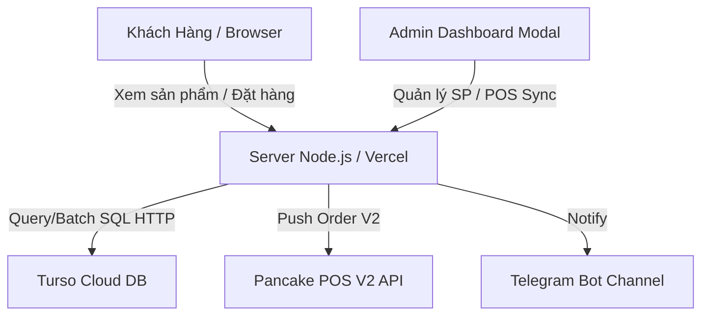

# UI_MAP.md — Cấu Trúc Giao Diện & Luồng Dữ Liệu Thỏ Hồng Store

## 🌐 1. Kiến Trúc Tổng Hệ Thống



---

## 📄 2. Danh Sách Trang & Component Frontend (`public/index.html`)

### 🛒 Trang Khách Hàng (Customer View)
- **Chức năng**: Hiển thị danh mục sản phẩm, tìm kiếm, giỏ hàng, form nhập địa chỉ và xác nhận đơn hàng.
- **Vai trò**: UI thuần + Client State Management (LocalStorage giỏ hàng).
- **Đọc/Ghi data**:
  - Đọc: `GET /api/products`, `GET /api/categories`, `GET /api/settings`
  - Ghi: `POST /api/orders`
- **Liên kết**: Mở modal Giỏ hàng, Modal Chi tiết Sản phẩm, Modal Đặt hàng.

### 🔐 Modal Quản Trị (Admin Panel)
- **Chức năng**: Đăng nhập Admin, quản lý kho hàng, đổi giá, import Excel, đồng bộ POS thủ công, viết bài Blog AI.
- **Vai trò**: Admin Management Data Module.
- **Đọc/Ghi data**:
  - Đọc: `GET /api/settings/private`, `GET /api/pos/history`, `GET /api/admin/blog`, `GET /api/admin/keywords`
  - Ghi: `POST /api/login`, `POST /api/products`, `DELETE /api/products/:id`, `GET /api/pos/sync`, `POST /api/admin/blog/generate`
- **Liên kết**: Đăng nhập JWT -> Mở bảng điều khiển Admin -> Logout.

---

## 🎨 3. Quy Chuẩn Thiết Kế Giao Diện Menu Admin CP & Collapsible Sections

### 📐 A. Cấu Trúc Khung Admin Panel Modal Chuẩn
Để tránh lỗi kẹp kép overflow và mất nút lưu trên mobile, toàn bộ Admin Panel tuân theo kiến trúc Flex:
1. **Modal Outer Overlay**: `position: fixed; inset: 0; z-index: 1000;`
2. **Modal Box (`.admin-modal`)**:
   ```css
   max-width: 920px; width: 95%; padding: 0; display: flex; flex-direction: column; max-height: 90vh;
   ```
   *(Tuyệt đối KHÔNG đặt `overflow: hidden` ở container cha nếu bên trong có cuộn).*
3. **Thanh Tab Menu Cuộn Ngang (Mobile-First)**:
   ```css
   display: flex; gap: 4px; padding: 8px 12px; border-bottom: 2px solid #e2e8f0; background: #f8fafc;
   overflow-x: auto; flex-shrink: 0; scrollbar-width: none; -webkit-overflow-scrolling: touch;
   ```
4. **Tab Content Wrapper**:
   ```css
   padding: 1.5rem; flex: 1; overflow-y: auto; min-height: 0;
   ```

---

### 🔽 B. Pattern Đóng / Mở Section (Collapsible Sections Pattern)

Khi xây dựng hoặc mở rộng các Tab Menu Admin lớn chứa nhiều khối tính năng (API Key, Hàng đợi, Form cấu hình, Log bài viết...), BẮT BUỘC áp dụng Pattern 3 thành phần này:

#### 1. CSS Standard (Dùng Sibling Selector `:not(:first-child)`)
```css
/* Ẩn toàn bộ con trừ Header (con đầu tiên) khi collapsed */
.blog-sec-collapsed > *:not(:first-child) { display: none !important; }
.blog-sec-collapsed { padding-bottom: 6px !important; margin-bottom: 0.6rem !important; opacity: 0.85; }

/* Icon mũi tên xoay -90deg khi thu gọn */
.sec-toggle-arrow { 
    display: inline-flex; align-items: center; justify-content: center; 
    width: 22px; height: 22px; border-radius: 6px; background: rgba(0,0,0,0.06); 
    font-size: 0.6rem; color: #64748b; transition: transform 0.3s ease; flex-shrink: 0; 
}
.blog-sec-collapsed .sec-toggle-arrow { transform: rotate(-90deg); background: rgba(0,0,0,0.1); }
.blog-sec-collapsed:hover { opacity: 1; }
```

#### 2. JavaScript Standard (Lưu Trạng Thái Đóng/Mở vào LocalStorage)
```javascript
function toggleBlogSection(id, ev) {
    // Tránh trigger toggle khi click nút bấm hoặc input nằm trong Header
    if (ev && ev.target.closest('button, a, input, select')) return;
    const el = document.getElementById(id);
    if (!el) return;
    const collapsed = el.classList.toggle('blog-sec-collapsed');
    try {
        const st = JSON.parse(localStorage.getItem('blogSecStates') || '{}');
        st[id] = collapsed;
        localStorage.setItem('blogSecStates', JSON.stringify(st));
    } catch(e) {}
}

// Khôi phục trạng thái đã lưu khi mở trang
(function initBlogSections() {
    try {
        const st = JSON.parse(localStorage.getItem('blogSecStates') || '{}');
        for (const [id, v] of Object.entries(st)) {
            if (v) {
                const el = document.getElementById(id);
                if (el) el.classList.add('blog-sec-collapsed');
            }
        }
    } catch(e) {}
})();
```

#### 3. HTML Markup Chuẩn
```html
<!-- Container section phải có ID duy nhất & transition nhẹ -->
<div id="blogSecX" style="background:#f8fafc; border:1px solid #e2e8f0; border-radius:10px; padding:1.2rem; margin-bottom:1rem; transition:all 0.2s;">
    <!-- Header PHẢI là phần tử con đầu tiên (:first-child) -->
    <div onclick="toggleBlogSection('blogSecX', event)" style="font-weight:700; cursor:pointer; user-select:none; display:flex; justify-content:space-between; align-items:center;">
        <span>📝 Tiêu Đề Block <span class="sec-toggle-arrow">▾</span></span>
        <!-- Nút bấm con (nếu có) không bị ảnh hưởng nhờ ev.target.closest() -->
        <button class="btn btn-primary" onclick="doAction()">Action</button>
    </div>

    <!-- Nội dung bên trong giữ nguyên, không cần div wrapper phụ -->
    <div>Nội dung 1...</div>
    <div>Nội dung 2...</div>
</div>
```

