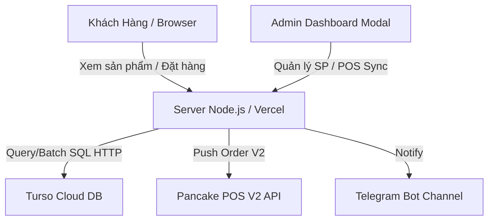

# UI_MAP.md — Cấu Trúc Giao Diện & Luồng Dữ Liệu Thỏ Hồng Store

## 🌐 1. Kiến Trúc Tổng Hệ Thống

---

## 📄 2. Danh Sách Trang & Component Frontend (`public/index.html`)

### 🛒 Trang Khách Hàng (Customer View)
- **Chức năng**: Hiển thị danh mục sản phẩm, tìm kiếm, giỏ hàng, form nhập địa chỉ và xác nhận đơn hàng.
- **Vai trò**: UI thuần + Client State Management (LocalStorage giỏ hàng).
- **Đọc/Ghi data**:
  - Đọc: `GET /api/products`, `GET /api/categories`, `GET /api/settings`
  - Ghi: `POST /api/orders`
- **Liên kết**: Mở modal Giỏ hàng, Modal Chi tiết Sản phẩm, Modal Đặt hàng.

### 🔐 Modal Quản Trị (Admin Panel)
- **Chức năng**: Đăng nhập Admin, quản lý kho hàng, đổi giá, import Excel, đồng bộ POS thủ công.
- **Vai trò**: Admin Management Data Module.
- **Đọc/Ghi data**:
  - Đọc: `GET /api/settings/private`, `GET /api/pos/history`
  - Ghi: `POST /api/login`, `POST /api/products`, `DELETE /api/products/:id`, `GET /api/pos/sync`
- **Liên kết**: Đăng nhập JWT -> Mở bảng điều khiển Admin -> Logout.
